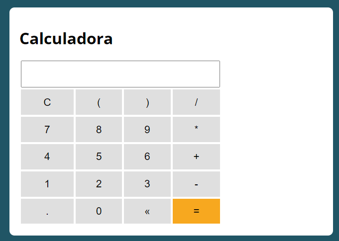

# Calculadora

O seguinte projeto visa construir uma **Calculadora** simples que executa as diversas operações matemáticas.

## Conhecimentos Aplicados

* `JS`, utilizando
   * OOP
   * Código Limpo
   * Funções
* ``HTML`` e `CSS` para interação do Usuário

## Demonstração

